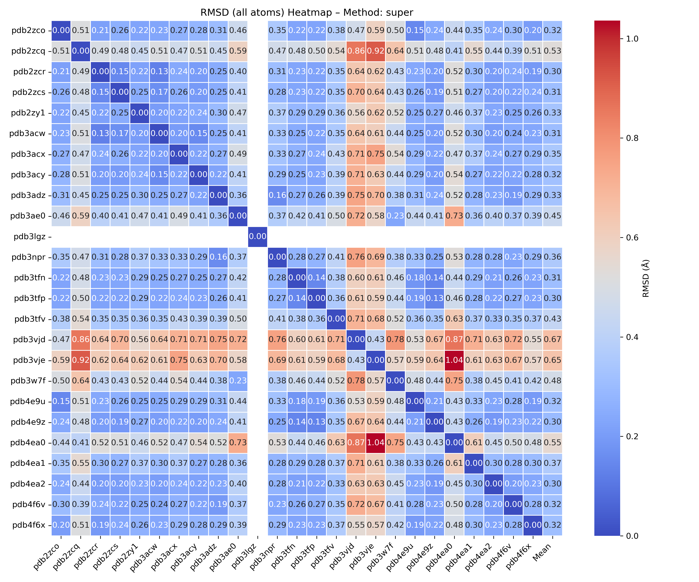
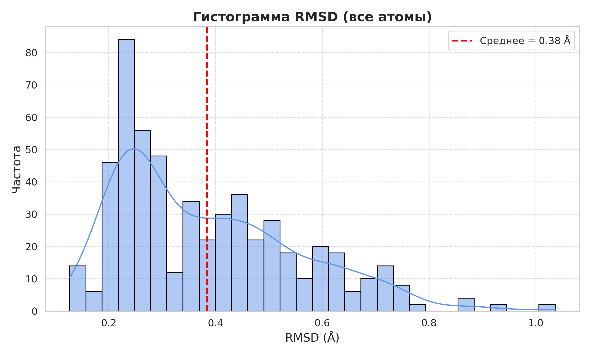
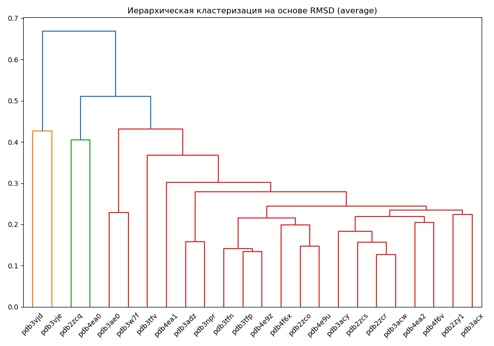

# 🤖 PocketMaster - Pocket Analyzer
PocketMaster - удобный инструмент для анализа сходства белковых карманов.
Скрипт помогает провести структурное выравнивание, анализировать карманы, вычислять RMSD, строить красивые графики и визуализации.

## Основные возможности

- ✅ **Автоматическое выравнивание** белковых структур  
- ✅ **Гибкое определение кармана** - как по координатам лиганда, так и вручную  
- ✅ **Расчёт RMSD** по всем атомам и по атомам Cα в пределах карманов  
- ✅ **Поддержка различных методов RMSD**: `align`, `cealign`, `super`, `rms`, `rms_cur`  
- ✅ **Сохранение выровненных структур** и результатов анализа  
- ✅ **Генерация кратких отчётов** с данными о структурных и последовательностных различиях карманов  
- ✅ **Построение наглядных визуализаций**: Тепловые карты (heatmap), Дендрограммы,Гистограммы  
- ✅ **Выбор метода кластеризации**: `ward`, `single`, `complete`, `average`, `centroid`, `median`, `weighted`
- ✅ **Настройка способа кластеризации**: по числу кластеров (`maxclust`), по порогу расстояния (`distance`), автоматические режимы (`Elbow method`, `70% of maximum linkage distance threshold`)

---

С PocketMaster вы сможете быстро и эффективно анализировать пространственное сходство активных участков белков, получая подробные отчёты и визуализации для глубокой интерпретации результатов.

## Примеры визуализаций

<p float="left">
  
  
  
</p>

**Сравнение карманов:** heatmap.png, rmsd_all_atoms_hist.png, dendrogram.png

## ⚙️ Зависимости

Для корректной работы скрипта необходимы следующие библиотеки и инструменты:

- **Python 3.x**
- **PyMOL** с поддержкой Python API (доступ к модулю `pymol`)
- **NumPy** — численные вычисления  
  Установка: `pip install numpy`
- **Matplotlib** — построение графиков и гистограмм  
  Установка: `pip install matplotlib`
- **Seaborn** — улучшенная визуализация (в том числе тепловые карты)  
  Установка: `pip install seaborn`
- **Pandas** — работа с таблицами и CSV  
  Установка: `pip install pandas`
- **SciPy** — для кластеризации и анализа расстояний  
  Установка: `pip install scipy`
- **YAML** — для работы с конфигурационными YAML-файлами  
  Установка: `pip install yaml`

## Установка зависимостей

Для удобства вы можете установить все необходимые зависимости двумя способами:

### 1. Установка через pip (с использованием файла requirements.txt)

Если у вас уже установлен Python и менеджер пакетов pip, выполните команду:

```bash
pip install -r requirements.txt
```
> ⚠️ Обратите внимание: PyMOL не устанавливается через pip.  
> Его необходимо устанавливать отдельно — вручную или через conda (см. ниже).

### 2. Установка через conda (с использованием environment.yml)

Рекомендуемый способ - использовать Anaconda или Miniconda. Для создания и активации окружения выполните:

```bash
conda env create -f environment.yml
conda activate pmaster
```

## 🚀 Как запустить

Поддерживаются два режима запуска:

###  Интерактивный режим
Вы можете запускать скрипт с пошаговым вводом параметров вручную:

```bash
python PocketMaster.py
```

###  Режим с конфигурационным файлом
Для автоматического запуска с заранее заданными параметрами используйте YAML-файл конфигурации:

```bash
python PocketMaster.py --config config.yaml
```
📌 Пример конфигурационного файла см. в папке examples/config.yaml.

Дополнительно, при запуске в интерактивном режиме в конце работы создаётся файл run_config.txt, в который автоматически сохраняются все введенные
пользователем параметры. Это позволяет в дальнейшем выполнять запуск с теми же настройками в автоматическом режиме, без необходимости повторного ввода исходных данных.

  
## 📋 Как использовать

Запустите скрипт **PocketMaster.py** в интерактивном режиме командой, приведённой выше,  
чтобы перейти в интерактивный режим и задать параметры вручную.


🧭 Следуйте интерактивным подсказкам:

🔹 **Выбери режим работы:**  
  1 –  Использовать локальную папку с PDB файлами  
  2 –  На основе UniProt ID скачать все соответствующие PDB структуры  
  3 –  На основе PDB ID определить UniProt ID и скачать все соответствующие PDB структуры  

🔹 **Провести предварительную очистку структур?**    
  1 –  Да  
  2 –  Нет  

🔹 **Выберите подходящие опции предварительной обработки структур**    
  1 –  Удалить воду (solvent)  
  2 –  Удалить ионы металлов (metal ions)  
  3 –  Удалить сульфаты и фосфаты (SO4, PO4, и др.)  
  4 –  Удалить буферные компоненты (TRS, MES, HEP, и др.)  
  5 –  Удалить криопротектанты (GOL, EDO, MPD, и др.)  
  6 –  Удалить восстановители (DTT, BME, TCEP)  
  7 –  Удалить всё воду, ионы, буферы, криопротектанты, фосфаты, восстановители   
  8 –  Удалить модифицированные аминокислотные остатки (CSO, MSE, SEP, TPO, PTR и др.)   
  9 –  Удалить всё, кроме белка (оставить только полимерную цепь   
  10 – Удалить альтернативные конформации (altloc)  
  11 – Удалить анизотропные параметры (ANISOU)  
  12 – Удалить атомы водорода (H)  
  13 – Сохранить обработанные структуры в определённой папке  
  14 – Не очищать / Завершить выбор  
  
🔹 **Выберите референсную структуру для выравнивания**  
  – введя её порядковый номер из представленного списка: 

🔹 **Выбор способа определения участка для выравнивания**  
  1 – На реф. структуре по заданному ID остатка и радиусу (Å), затем он ищется и выравнивается во всех структурах  
  2 – После предварительного выравнивания всех структур между собой, для каждой структуры вокруг выбранного реф. остатка  
  3 – Для каждой структуры вокруг её HET-групп в пределах заданного радиуса (Å)  
  4 – По введённому пользователем списку остатков, затем ищется во всех структурах  
  5 – На реф. структуре по указанному идентификатору цепи, затем ищется и выравнивается во всех структурах 

***
<p align="left">Поддерживаемые методы определения участков для выравнивания и их детальная интерпретация.</p>
<p align="left">
  
</p>

***

🔹 **Выберите режим сравнения:**  
  1 – «все со всеми» (all vs all)  
  2 – «все с референсом» (all vs ref)  

🔹 **Укажите метод расчёта RMSD:**  
  1 – `align`строгая RMSD-оценка, используется для точного выравнивания, исключая атомы, не имеющие соответствий.  
  2 – `cealign` Структурное выравнивание на основе геометрии, эффективно даже при низком сходстве.  
  3 – `super` гибкий вариант, допускает несовпадения и автоматически подбирает соответствующие атомы.  
  4 – `rms` rms: точный RMSD, работает только при полном соответствии атомов (без несовпадений).  
  5 – `rms_cur` rms_cur: упрощённый и более быстрый расчёт RMSD, также требует полного соответствия атомов.  

🔹 **Выбери метод иерархической кластеризации:**  
  1 – ward (минимизация внутрикластерной дисперсии, требует евклидово расстояние)  
  2 – single (минимальное расстояние между кластерами)  
  3 – complete (максимальное расстояние между кластерами)  
  4 – average (среднее расстояние между кластерами (UPGMA))  
  5 – centroid (расстояние между центрами масс кластеров)  
  6 – median (медианное расстояние между кластерами)  
  7 – weighted (взвешенное среднее расстояние (WPGMA))  

<h3 align="left">📊 Сравнение методов кластеризации</h3>

<p align="left">

| Метод      | Компактные кластеры | Вытянутые кластеры | Чувствительность к выбросам |
|-------------|--------------------|--------------------|------------------------------|
| Ward        | ✅ Отлично          | ❌ Плохо           | ⚠️ Средняя                   |
| Single      | ❌ Плохо            | ✅ Отлично         | ⚠️ Высокая                   |
| Complete    | ✅ Хорошо           | ❌ Плохо           | ✅ Устойчив                  |
| Average     | ✅ Универсально     | ✅ Неплохо         | ⚠️ Средняя                   |
| Centroid    | ⚠️ Нестабильно      | ⚠️ Нестабильно     | ⚠️ Нестабильно               |
| Median      | ⚠️ Нестабильно      | ⚠️ Нестабильно     | ⚠️ Нестабильно               |
| Weighted    | ✅ Хорошо           | ✅ Хорошо          | ⚠️ Средняя                   |

</p>
<br>

🔹 **Параметры кластеризации: количество или порог**  
  1 – Задать количество кластеров (maxclust)  
  2 – Задать порог расстояния (distance)  
  3 – Автоматический: Порог на основе 70% процента максимального расстояния слиянияя  
  4 – Автоматический: Метод Изгиба или Локтя (Elbow Method)  

🔹 **Выберите тип RMSD:**  
  1 – по всем атомам  
  2 – только по Cα-атомам

## После выполнения

Скрипт создаёт папку `output` в указанной директории, содержащую:

1. `aligned_structures/`: Выровненные PDB файлы (например, `structure_aligned_to_ref.pdb`).
2. `rmsd_all_atoms.csv`: RMSD для всех атомов кармана.
3. `rmsd_calpha.csv`: RMSD только для Cα атомов.
4. `info.txt`: Информация о референсной структуре, методе задания кармана,  выравниваниях и сравнении остатков карманов.
5. `rmsd_all_atoms_hist.png`: Гистограмма RMSD для всех атомов.
6. `rmsd_calpha_hist.png`: Гистограмма RMSD для Cα атомов.
7. `Результаты кластеризации`: cluster_assignments.csv.
8. `Тепловая карта`: rmsd_heatmap.png.
9. `Дендрограмма`: RMSD_dendrogram.png.

## Структура директорий

- `data/` — папка с исходными PDB-файлами для анализа  
- `output/` — папка, куда после запуска скрипта автоматически сохраняются:  
  - выровненные структуры  
  - CSV-файлы с результатами расчетов  
  - текстовые отчёты и гистограммы

При запуске скрипта он автоматически обрабатывает все PDB-файлы из папки data/, выполняет выравнивание и анализ, после чего сохраняет все результаты в соответствующих форматах в папке data/output/. Такая организация упрощает работу с файлами и позволяет быстро ориентироваться в результатах


## 📌 Советы
Используй одинаково обработанные PDB-файлы (удаление воды, лигандов и т.д.)

## ⚠️ Возможные проблемы

- **Пустые селекции**  
  Если после определения кармана не удаётся выбрать атомы (например, из-за отсутствия соответствующих остатков), RMSD **не рассчитывается**.

- **Разное число атомов**  
  Скрипт выдаёт предупреждение при различии числа атомов в выравниваемых объектах. Это **особенно критично** для методов `rms` и `rms_cur`, которые требуют **полное соответствие атомов**.

- **Ошибки выравнивания**  
  Если структура не может быть выровнена (например, из-за отсутствующих атомов или несовпадения цепей), она **пропускается**, а информация об этом добавляется в **лог-файл**.

## 📧 Обратная связь
Если у тебя есть предложения или баг-репорты — не стесняйся связаться!

## ⭐ Поддержи проект
Если скрипт помог — поставь ⭐ на GitHub и расскажи другу-структурщику!

## Лицензия
MIT License. Используйте, модифицируйте и распространяйте свободно с указанием авторства.

